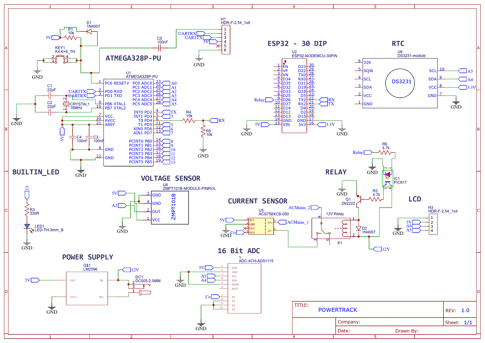
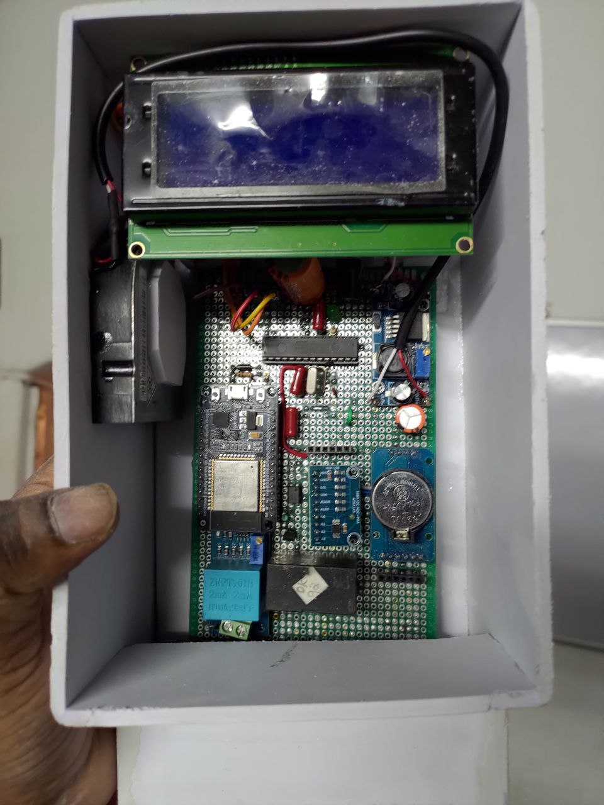
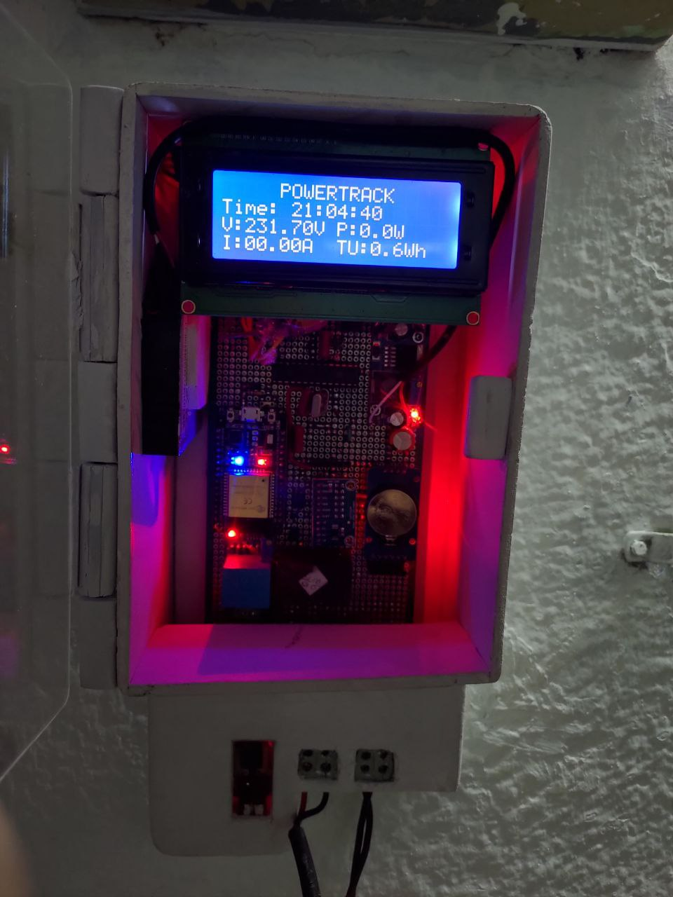

# PowerTrack - An IoT Based Energy Meter

## Overview

PowerTrack is a smart energy monitoring device that leverages IoT technology to track and manage electricity consumption. It measures various electrical parameters such as **Voltage**, **Current**, **Power**, and **Energy** in real time. With PowerTrack, users can analyze energy usage patterns, calculate electricity bills based on dynamic pricing, and optimize their energy consumption for efficiency and cost savings.

Powered by an **ATmega328P** microcontroller and an **ESP32** module for Wi-Fi connectivity, PowerTrack transmits data to a **Firebase Database** for secure storage and analysis. It integrates with **Google Sheets** for seamless data visualization, providing users with an intuitive interface to monitor their energy usage from anywhere.

---

## Features

- **Real-Time Monitoring**: Tracks voltage, current, power, and energy consumption with high accuracy.
- **Dynamic Bill Calculation**: Computes electricity bills based on time-of-day pricing and usage patterns.
- **Data Logging**: Stores historical consumption data in Firebase for future analysis.
- **Remote Monitoring**: Access energy data through a custom mobile app or Google Sheets.
- **Multi-Screen Display**: Displays live readings, units consumed, and billing information on a 20x4 LCD.
- **Alert System**: Sends real-time notifications for abnormal voltage or current levels.
- **Time-Based Pricing**: Supports energy pricing adjustments based on time-of-day rates (Day, Evening, Night).
- **Smart Appliance Control**: Manages connected appliances via a relay based on predefined conditions.

---

## Components Used

### Hardware

| **Component**         | **Description**                                                                      |
|-----------------------|------------------------------------------------------------------------------------|
| **ATmega328P**         | Microcontroller for sensor data processing and control logic.                      |
| **ESP32**              | Wi-Fi module for internet connectivity and Firebase integration.                   |
| **ZMPT101B**           | Voltage sensor for precise AC voltage measurements.                                |
| **ACS758**             | Current sensor for accurate AC current measurements.                               |
| **ADS1115**            | Analog-to-Digital Converter for enhanced current sensing precision.                |
| **RTC DS3231**         | Real-time clock for accurate timekeeping and billing calculations.                 |
| **20x4 LCD Display**   | Displays live data, including voltage, current, power, and billing information.    |
| **Cooling Fan**        | Optional component for thermal management of the system.                           |
| **EEPROM**             | Non-volatile memory module for storing historical energy consumption data.         |

### Libraries

| **Library**              | **Purpose**                                                                        |
|--------------------------|------------------------------------------------------------------------------------|
| `LiquidCrystal_I2C`      | Controls the 20x4 LCD display for data visualization.                              |
| `ADS1X15`                | Interfaces with the ADS1115 ADC for current measurement.                           |
| `Wire`                   | Enables I2C communication for sensor and display interfacing.                     |
| `SoftwareSerial`         | Facilitates serial communication on additional digital pins.                      |
| `ZMPT101B`               | Interfaces with the ZMPT101B voltage sensor.                                      |
| `RTClib`                 | Manages interactions with the DS3231 real-time clock module.                      |
| `EEPROM`                 | Reads and writes energy data to EEPROM memory.                                    |
| `WiFi`                   | Establishes Wi-Fi connectivity for the ESP32.                                     |
| `ESP32Firebase`          | Sends and retrieves data from Firebase.                                           |
| `WiFiClientSecure`       | Creates secure internet connections for data transmission.                        |
| `TRIGGER_WIFI`           | Custom library for robust Wi-Fi connection management.                           |
| `TRIGGER_GOOGLESHEETS`   | Custom library for integrating Google Sheets for data logging.                    |

---

## Installation

### Prerequisites

- **Arduino IDE**: Install the [Arduino IDE](https://www.arduino.cc/en/software) for programming the ATmega328P and ESP32.
- **Firebase Account**: Set up a Firebase project to store energy consumption data.
- **Google Sheets API**: Configure a Google Sheets API for seamless data logging and visualization.

### Setup

1. Clone this repository or download the project files.
2. Install the required libraries in the Arduino IDE:
   - `LiquidCrystal_I2C`
   - `ADS1X15`
   - `Wire`
   - `SoftwareSerial`
   - `ZMPT101B`
   - `RTClib`
   - `EEPROM`
   - `WiFi`
   - `ESP32Firebase`
   - `WiFiClientSecure`
   - `TRIGGER_WIFI`
   - `TRIGGER_GOOGLESHEETS`
3. Assemble the components as per the provided circuit diagram.
4. Configure Wi-Fi credentials (SSID and Password) in the ESP32 code.
5. Upload the respective code to the ATmega328P and ESP32 using the Arduino IDE.

---

## Visuals

### Circuit Diagram

### Hardware Prototype

---

## Code Overview

### ATmega328P Code

The ATmega328P handles sensor data acquisition and processes the data for real-time display and energy billing. Key features include:

- `Get_Voltage()`: Reads voltage from the ZMPT101B sensor.
- `getRmsCurrent()`: Calculates RMS current using the ACS758 sensor.
- `getPower()`: Computes real power based on voltage and current readings.
- `getEnergy()`: Tracks cumulative energy consumption.
- `Price_Calculation()`: Determines electricity bills based on time-of-day pricing.
- `SendReceiveData()`: Transfers data to the ESP32 for Firebase integration.

### ESP32 Code

The ESP32 facilitates communication with Firebase and Google Sheets. Key features include:

- `Google_Sheets_Init()`: Initializes Google Sheets for data logging.
- `Firebase.setFloat()`: Sends real-time energy data to Firebase.
- **Relay Control**: Manages appliances based on voltage/current thresholds.

---

## Firebase Setup

1. Create a Firebase project and configure the Realtime Database.
2. Add Firebase credentials (API Key, Database URL, etc.) to the ESP32 code.
3. Define database fields for **Voltage**, **Current**, **Power**, **Units**, and **Total Rate**.
4. Set up Firebase rules for secure data access.

---

## Google Sheets Setup

1. Create a Google Sheet for visualizing energy consumption trends.
2. Configure Google Apps Script to handle API calls from the ESP32.
3. Share the sheet with appropriate permissions for remote access.

---

## Usage

1. Power on the system and ensure all components are correctly connected.
2. Monitor live readings on the 20x4 LCD display.
3. Access Firebase or Google Sheets for remote data visualization.
4. Utilize relay control to automate appliance management based on defined criteria.

---

## Troubleshooting

- **Wi-Fi Issues**: Verify SSID and password in the ESP32 code.
- **Incorrect Sensor Readings**: Check sensor connections and calibration.
- **Relay Malfunction**: Inspect relay logic and Firebase settings.

---

## Team Members

- **Amith Mathew Titus**
- **Anugraha M.**
- **Chaithanya C.**

---

## License
This project is licensed under the **MIT License**. See the [LICENSE](LICENSE) file for details.

---

## Contact
For any queries or contributions:
- **Amith Mathew Titus**: amithmathewtitus@outlook.com
- **Anugraha M.**: anugrahamahesh28@gmail.com

---

**Project Status**: Completed ✅
